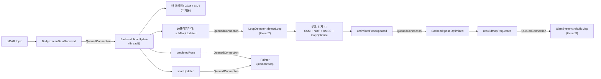

# test_icp 소스 분석

## 개요

현재 소스는 ROS2에서 받은 라이다/오도메트리 데이터를 Qt 기반 UI와 연결해서, 
실시간 스캔 매칭 기반 위치 추정과 간단한 pose graph 최적화를 수행하는 2D SLAM 구조다.

전체 흐름은 아래와 같다.

1. `Bridge`가 ROS2 센서 데이터를 Qt signal로 전달한다.
2. `ScanMatchBackend`가 오도메트리 적분과 스캔 매칭으로 현재 pose를 추정한다.
3. 일정 프레임마다 local map을 submap으로 저장하고 pose graph에 노드를 추가한다.
4. `LoopDetecter`가 과거 submap과 현재 submap을 비교해 loop closure를 찾는다.
5. loop edge가 누적되면 pose graph 최적화를 수행한다.
6. 최적화 결과가 들어오면 world map을 다시 구성한다.
7. `Painter`가 world map, 현재 scan, trajectory를 그린다.

## 주요 클래스 역할

### 1. `ScanMatchBackend`

핵심 온라인 추정기다.

- 입력
	- 라이다 scan: `lidarUpdate`
	- odom: `odomUpdate`
	- 최적화 결과 delta: `poseOptimized`
- 내부 상태
	- `map_x`, `map_y`, `map_theta`: 현재 추정 pose
	- `odom_x`, `odom_y`, `odom_theta`: 마지막 odom 상태
	- `world_map`: 누적 occupancy map
	- `local_map`: 최근 scan들을 쌓는 임시 map
	- `sub_maps`: local map을 잘라 저장한 submap 목록
	- `pose_graph`: submap pose들의 그래프

역할은 크게 3가지다.

1. odom 기반 prediction
2. scan matching 기반 correction
3. submap 생성 및 pose graph 갱신

#### `odomUpdate`

odom 변화량을 계산해 현재 `map_*` pose에 반영한다.

- `change_x`, `change_y`, `change_theta`를 계산
- odom 기준 변화량을 현재 map 기준으로 투영
- 결과를 `map_x`, `map_y`, `map_theta`에 누적

즉, scan matching 전의 초기값 생성기 역할이다.

#### `lidarUpdate`

실제 메인 파이프라인이다.

1. 일정 프레임마다 `local_map`을 submap으로 승격
2. 승격 직전 월드 좌표의 점들을 `world_map`에 반영
3. submap 저장 시에는 현재 pose inverse를 적용해서 local 좌표계로 변환
4. 최근 local map + 주변 world map 점들을 합쳐 reference map 생성
5. 필요시 CSM 후 NDT, 아니면 NDT만 수행
6. 결과가 odom 예측에서 너무 튀면 가중 평균으로 완화
7. 결과 pose로 현재 scan을 world 좌표로 변환해서 `local_map`에 누적

#### scan matching 정책

현재 구현은 매 프레임 CSM을 돌리지 않는다.

- 이동량이 충분히 크거나 LUT가 무효화되면 `CSM -> NDT`
- 그렇지 않으면 `NDT`만 수행

의도는 다음과 같다.

- CSM: 넓은 범위 coarse search
- NDT: 주변에서 fine alignment
- 자주 CSM을 호출하지 않아서 속도를 아낌

### 2. `LoopDetecter`

submap 간 loop closure 후보를 찾고, 검증되면 pose graph에 loop edge를 추가한다.

동작 순서는 아래와 같다.

1. 현재 submap index가 충분히 커졌는지 확인
2. 과거 pose 중 현재 위치와 가까운 것만 candidate로 선택
3. 거리순으로 정렬 후 일부 후보만 refine
4. 현재 submap과 과거 submap 사이의 초기 상대 pose를 계산
5. 초기 평균 score가 낮으면 탈락
6. `CSM -> NDT`로 상대 변환 정밀화
7. RMSE와 평균 score 둘 다 만족하면 loop edge 등록
8. loop edge가 일정 개수 이상이면 `pose_graph->loopOptimize()` 실행

현재 정책상 loop edge를 찾을 때마다 바로 최적화하지 않고,
`pending_loop_edges_`를 모아 일정 횟수마다 최적화한다.

이 구조는 불필요한 최적화 빈도를 줄이기 위한 것이다.

### 3. `PoseGraph`

submap pose 히스토리와 edge를 저장한다.

- node: 각 submap의 global pose
- odom edge: 연속 프레임 간 상대 이동
- loop edge: loop closure로 추가된 강한 제약

#### 최적화 경로

`TEST_ICP_HAS_G2O`가 켜져 있으면 g2o 경로를 사용한다.

- 현재는 `OptimizationAlgorithmLevenberg`
- linear solver는 `LinearSolverEigen`

g2o가 없으면 fallback으로 Eigen sparse solver를 사용한다.

- `Eigen::SparseMatrix<double>`로 Hessian 구성
- `Eigen::SimplicialLDLT`로 해를 계산

이전 dense `MatrixXd + LDLT`보다 현재 fallback이 훨씬 낫다.
pose 수가 늘어날수록 메모리와 계산량 차이가 크게 난다.

### 4. `MapBackend`

occupancy map 역할을 한다.

- 내부 저장소는 `std::map<pair<int,int>, Weight>`
- 각 cell은 `hit_count`, `miss_count`를 가진다.
- `updateOccupancyMap`은 ray 기반 free-space marking까지 수행한다.

현재 map 처리 방식은 아래와 같다.

- scan endpoint는 hit 증가
- sensor에서 endpoint까지 ray tracing하며 free cell miss 증가
- hit/miss 비율이 일정 이상이면 static cell로 간주
- scan matching reference는 주로 static cell만 사용

즉, 단순 point cloud 누적이 아니라 occupancy 기반의 안정화된 map을 만들려는 구조다.

### 5. `Painter`

Qt 위젯 기반 디버그 시각화 계층이다.

그리는 요소는 3개다.

- `world_pixmap`: world map
- `lader_pixmap`: 최근 scan
- `pixmap`: trajectory 및 현재 heading

현재 `predictedPoseUpdate`가 들어올 때마다

1. world map 다시 그림
2. trajectory 그림
3. 현재 로봇 방향 화살표 그림

을 수행한다.

## 쓰레드 구조

현재 구조는 Qt `QThread`를 분리해서 사용한다.

- backend thread: `ScanMatchBackend`
- loop thread: `LoopDetecter`
- slam thread: `SlamSystem`
- GUI thread: `Painter`

중요한 점은 `world_map`, `sub_maps`, `pose_graph`, `map_x/y/theta` 일부 상태가 여러 쓰레드에서 공유된다는 점이다.

그래서 현재 핵심 공유 데이터는 `shared_data_mutex_`로 보호한다.

### 현재 lock이 필요한 영역

- `world_map.updateOccupancyMap`
- `world_map.getAdjacentPos`
- `pose_graph` 접근
- `sub_maps` 접근
- `rebuildMap` 중 world map 전체 재구성
- `Painter`에서 world map / pose history 읽기

최근 수정으로 다음 문제는 이미 반영되어 있다.

1. `world_map.updateOccupancyMap`를 mutex 밖에서 호출하던 경쟁 상태 수정
2. `Painter`가 world map/pose graph를 락 없이 읽던 경쟁 상태 수정

즉, loop optimization 직후 `rebuildMap()`과 `lidarUpdate()`가 겹치면서 나던 segmentation fault 가능성은 이전보다 줄어든 상태다.

## 데이터 흐름 상세

### 1. odom 수신

`Bridge::odomDataReceived`

-> `ScanMatchBackend::odomUpdate`

-> 현재 pose prediction 갱신

### 2. scan 수신

`Bridge::scanDataReceived`

-> `ScanMatchBackend::lidarUpdate`

-> scan matching 수행

-> `local_map` 누적

-> `predictedPose`, `scanUpdated` emit

### 3. submap 생성

`frame_index` 기준으로 일정 scan 수마다

- `local_map`을 world 좌표 점군으로 읽음
- `world_map`에 occupancy 반영
- 현재 pose inverse를 적용해 local 좌표 submap으로 저장
- pose graph에 node 추가
- 이전 node와 odom edge 연결
- `local_map.clearMap()`
- `subMapUpdated(index)` emit

### 4. loop detection

`subMapUpdated`

-> `LoopDetecter::detectLoop`

-> 후보 탐색

-> CSM/NDT 검증

-> loop edge 추가

-> 조건 만족 시 `loopOptimize()`

-> `optimizedPoseUpdated(index, delta)` emit

### 5. map rebuild

`ScanMatchBackend::poseOptimized`

-> 최적화 이후 새 pose들에 delta 전파

-> 현재 추정 pose도 delta 적용

-> `rebuildMapRequested` emit

`SlamSystem::rebuildMap`

-> world map clear

-> 모든 submap을 최적화된 pose에 맞춰 다시 world 좌표로 투영

-> occupancy map 재생성

## 현재 scan matching 구현 특징

### 장점

- odom + scan matching을 혼합해서 초기값 안정성 확보
- CSM과 NDT를 분리해 coarse/fine alignment 역할 구분
- local map과 world map을 분리해 최근 관측과 누적 관측을 함께 사용
- loop closure를 넣어 장기 drift를 줄이는 구조

### 현재 구현상 눈에 띄는 특징

- submap 생성 주기는 현재 `10` 프레임이다.
- `cached_lut_`는 저장되지만 실제 재사용보다는 rebuild 여부 판단 플래그에 가깝다.
- `temp_wm`로 local/world 점들을 합친 뒤 reference를 구성한다.
- matching 결과가 odom 예측에서 너무 멀면 `alpha = 0.3`으로 제한한다.

## 현재 성능 관련 포인트

### pose graph fallback 개선 상태

g2o가 없을 때도 이제 dense Hessian이 아니라 sparse Hessian을 쓴다.

- 이전: `MatrixXd(3N x 3N)` + `LDLT`
- 현재: `SparseMatrix` + `SimplicialLDLT`

이 변경은 node 수가 늘어날수록 효과가 크다.

### 아직 성능 병목이 될 가능성이 큰 부분

1. `MapBackend` 내부 컨테이너가 `std::map`
2. `getAdjacentPos`가 전체 map 순회 기반
3. `Painter`가 pose update마다 world map 전체를 다시 그림
4. `LoopDetecter`가 후보 submap 복사를 수행
5. `runNDT` 내부 cell lookup이 반복적으로 일어남

즉, 작은 규모에서는 충분히 돌아가지만 map이 커지면 map 조회와 렌더링 쪽이 먼저 병목이 될 가능성이 높다.

## 현재 코드에서 주의해서 볼 부분

### 1. `PoseGraph` 내부 mutex와 외부 shared mutex가 혼재

`PoseGraph`는 자체 `mutex_`가 있고,
상위 계층은 별도의 `shared_data_mutex_`를 사용한다.

현재는 큰 문제가 바로 보이진 않지만,
락 순서가 뒤섞이면 deadlock 또는 중복 락 대기 구조가 생길 수 있다.

### 2. `odomUpdate` 적분 방식

현재는 odom 변위를 계산한 뒤 기존 heading 기준으로 world에 투영한다.
회전하면서 이동하는 상황에서 midpoint integration보다 덜 정확할 수 있다.

### 3. `g2o` 경로는 아직 `LinearSolverEigen`

g2o를 쓴다면 `LinearSolverCholmod` 또는 `LinearSolverCSparse`가 일반적으로 더 빠르다.
현재 g2o 경로는 동작은 하지만 sparse graph 관점에서 최적은 아니다.

### 4. `cached_lut_` 활용도

이름상 캐시처럼 보이지만 현재 `runCSM`은 내부에서 직접 ref를 받는다.
즉, 저장된 `cached_lut_`를 실제 scoring에 재사용하는 구조는 아직 완성형이 아니다.

## 파일별 요약

- `src/slam/slam.cpp`
	- 전체 객체 생성, signal-slot 연결, thread 분리, rebuild orchestration
- `src/slam/scan_match_backend.cpp`
	- 온라인 localization, local/world map 갱신, submap 생성
- `src/slam/loop_detecter.cpp`
	- loop candidate 탐색, 검증, loop edge 추가, 최적화 트리거
- `src/slam/base/my_pose_graph.cpp`
	- pose graph 저장 및 optimization
- `src/slam/base/map_backend.cpp`
	- occupancy map 업데이트와 static cell 판단
- `src/slam/base/scan_match.cpp`
	- ICP, Gauss-Newton ICP, NDT, CSM 구현
- `src/painter.cpp`
	- 디버그 시각화

## 한 줄 정리

현재 소스는

`odom prediction + CSM/NDT scan matching + submap 기반 pose graph loop closure + occupancy rebuild + Qt visualization`

을 한 프로젝트 안에 직접 구현한 2D SLAM 실험 코드다.

구조는 이미 전체 파이프라인이 연결되어 있고,
최근에는 concurrency 안정성과 pose graph fallback 성능이 일부 개선된 상태다.

## SLAM Flow Chart

